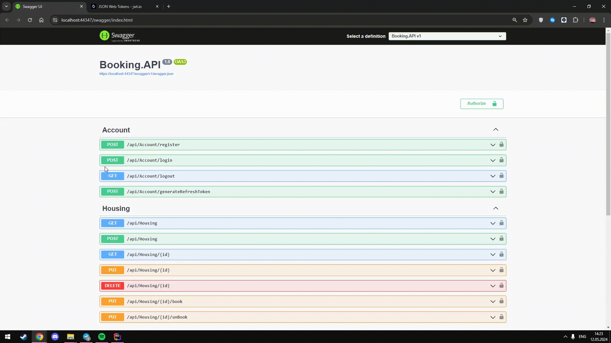

# BookingApi

### Regular registration via Identity and JwtToken, the default role is User

### The login also overwrites the JwtToken when logging in

### Only the admin can create, modify, delete Housing.

### If the Housing that had a booking is deleted, then the User who booked it will lose this booking

### When booking, the user specifies the HousingId they want to book, and if everything is successful, the isBooked status changes to true, and the user who booked it is added (the token is taken from the header)

### When unbooking, the isBooked status changes to false and the user who booked is removed from Housing
